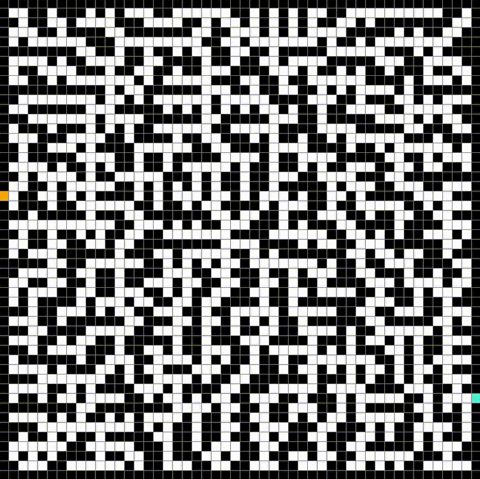

# Pathfinding/Graph Search Algorithms 

This is a Python (3.10+) implementation and visualization of various pathfinding algorithms.

There is also a web version of this at [this hyperlink](https://gurknathe.github.io/Pathfinding-Algorithms). However, there are a number of features that are missing including node-to-node updating. So, the final grid will display basically immediately after you click Run. Additionally, not every algorithm is implemented yet. 

The graph used is a static, undirected, unweighted, strongly connected graph (aka, a grid that doesn't change while algorithm is running).

The visualization is implemented using PyGame. Credits to [Tech With Tim](https://www.youtube.com/watch?v=JtiK0DOeI4A).

A maze generator is implemented, it has at least one valid path from the start to end node. The implementation is based on [this](https://github.com/OrWestSide/python-scripts/blob/master/maze.py).



See the explanations for the implemented algorithms [here](./resources/AlgorithmExplanations.md).

<strong>Warning: There is an issue with PyGame that can cause the program to crash. On my system running Linux Mint, the update display function causes a segmentation fault. Non-Windows users seem to be the group affected by this, so if you're using Windows, you should be fine.</strong>

## Command line arguments

There are three optional command line arguments: width, # rows, algorithm type.

<strong>Disclaimer: Testing is done on default settings, there is no guarantee, as of now, that things work smoothly for different widths and rows.</strong>

```
width >= 2
rows >= 2
algorithm = astar, bfs, dfs, dijkstra, rand, yen [See Algorithms.py for full list]
```

```
./pathfinding.py <width> <# rows> <algorithm type>
```

## Keydown Events

While an algorithm isn't running:

- Press <kbd>T</kbd> to test algorithms
- Press <kbd>B</kbd> to go to previous algorithm in list
- Press <kbd>N</kbd> to go to next algorithm in list
- Press <kbd>Q</kbd> to exit
- Press <kbd>C</kbd> to clear grid
- Press <kbd>G</kbd> to generate a new maze
- <kbd>Left Click</kbd> to place Start, then End, then Obstacles
- <kbd>Right Click</kbd> to remove Start, End, or Obstacles

After an algorithm has run:

- <kbd>W</kbd>, <kbd>Left Click</kbd>, or <kbd>Right Click</kbd> to clear the Algorithm Mark-up

While an algorithm is running:

- Press <kbd>S</kbd> key to stop the algorithm

## Testing

The testing function runs every implemented algorithm for the current grid. It outputs the time it took to run the algorithm and the number of node checks while running. The results are written into a CSV file, which can be found in the `main/testing/results` directory. An example output is given for a randomly generated maze, with default settings.

The testing will take longer as the visitable nodes increases. For my system, and a randomly generated maze on default settings, it takes ~4 minutes to run and save the data. The Floyd-Watshall algorithm takes up the most time and can vary significantly it the execution time (e.g., most of the time I get a run time of ~260 seconds where as of writing this I record a run time of ~670 seconds).

## Node Types

- Start: where the search algorithm will start
- End: where the search algorithm is trying to get to
- Obstacle: a position the algorithms avoid
- Check/Uncheck: markup for visualizing the algorithm
- Path: markup for visualizing the found path
- Default: a position that can be traversed

## Algorithm Progress

```
Currently implemented algorithms (21/31):

- A*
- Beam Search
- Bellman Ford's Algorithm
- Best First Search
- Bidirectional A*
- Bidirectional search
- Branch & Bound
- Breadth First Search (BFS)
- B*
- Depth First Search (DFS)
- Dijkstra's Algorithms
- Floyd-Warshall's algorithm
- Greedy Best First Search (GBFS)
- Greedy Best Line Search (GBLS)
- Iterative Deepening (IDA*)
- Iterative Deepening DFS (IDDFS)
- Jump Point Search (JPS)
- Lexicographic BFS
- Lifelong Planning A* (LPA*)
- Random Walk
- Theta*

Currently looking at:

- None

Planned algorithms (Going to look at them):

- Fast Iterative Method
- Fast Marching Method
- Fast Sweeping Method
- Fringe search

- Johnson's

- Kruskal's

- SMA*
- SUB

- Viterbi algorithm

- Yen's k-Shortest Paths
```

Possible incorrectly implemented algorithms:

- [B\*](./resources/b_star.pdf)
- [Branch and Bound](https://en.wikipedia.org/wiki/Branch_and_bound)
- [Jump Point Search](https://en.wikipedia.org/wiki/Jump_point_search)
