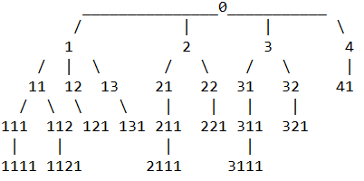

# Grid Graph to Tree from starting Node Algorithm (GGTN Algorithm):

## In words:

The starting node is labeled with a value of 0. 

From the start node, label all neighbors in increasing order starting from 1 to n-neighbors 
(neighbors are the up, down, left, and right in this case; labeling was done counter-clockwise, 
starting from the up neighbor).

Then, go to the smallest neighbor (1) and label all unvalued neighbors with "1" + 1 to 
n-neighbors (Example: a neighbor of 1 is labeled as 012 or 011 or 013).

Repeat this, going from smallest to largest value neighbor, and continue with the newly 
labeled neighbors until the grid is fully labeled.

### From the start node you can then construct a tree based off of the labelings:

For a 5x5 grid with start at 3 down from to left and 3 right from left



To reconstruct the graph based on the tree you need to know the method of labeling (i.e. did you label them in a certain order [e.g. clockwise, counter-clockwise])

There is probably a better labeling system than this, but it's the simplest thing I could come up with without thinking too much on it.

## Pseudocode:

```
func grid_graph_to_tree(Start, Direction : tuple indicating starting direction and labeling rotation (e.g. (up, clockwise))):
    create a priority queue Q
    create a dictionary D to store node node_value pairs
    set all node values to infinity
    set Start node value to 0
    add Start to Q
    
    while Q is not empty:
	    Current is popped from Q
    	for every Neighbor of Current node gotten according to Direction:
              label neighbors with the number of Current with the digit in increasing order from 1 - n-neighbors concatenated to the end of the number (e.g. Current label = 021 -> Neighbor label = 0211, 0212, 0213, 0214, ..., 0218)
    
    create a tree T with start as the root
    digit_count = 1
    while D is not empty:
        find node N with smallest node_value
        add N as a child of the parent of N (parent = N.node_value[digit_count - 1])
        remove N from D
    
    return T
```